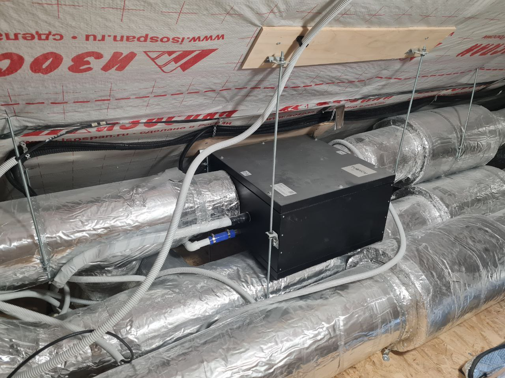
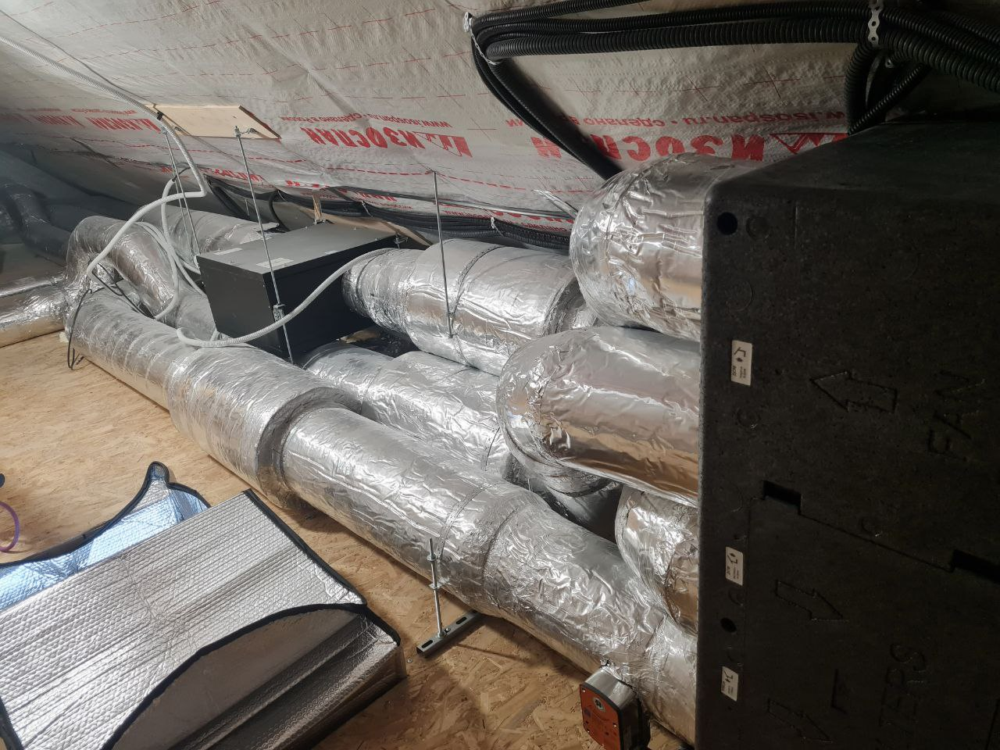
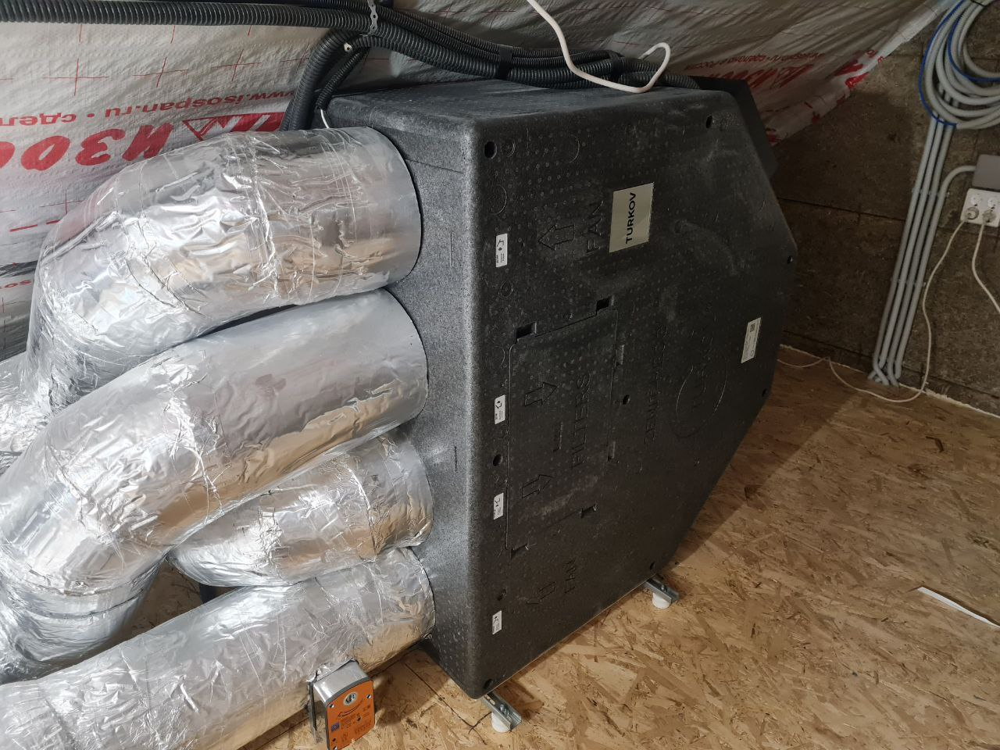
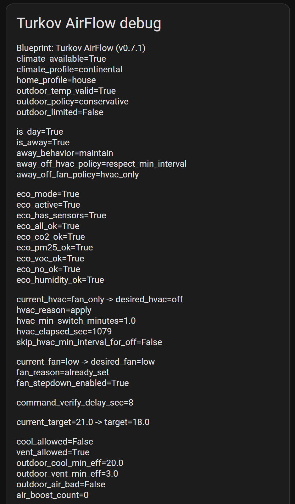
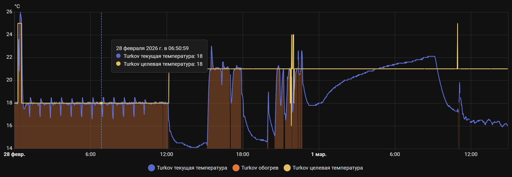

# Как я довёл автоматику ПВУ Turkov в Home Assistant до состояния «можно жить»

Привет, Хабр.

Долго выбирал приточно-вытяжную установку, в итоге взял Turkov — в том числе из-за интеграции с Home Assistant. Сама по себе интеграция оказалась недостаточной: без нормальной автоматики режимы дёргались, в мороз могла лезть вентиляция, при «никого нет» поведение было непредсказуемым. Написал свою логику в Blueprint и довёл до состояния, когда уже не страшно оставить дом на неделю. В статье — не «ещё один yaml», а разбор того, что реально ломалось, почему стандартные подходы подводили и какие фиксы в итоге сделали автоматику предсказуемой.

Репозиторий: <https://github.com/Gfermoto/hass-PVU>

## Кому будет полезно

- владельцам ПВУ Turkov с Home Assistant (или другой установки с climate-сущностью в HA);
- тем, кто пишет automation/blueprint и упирается в «странное» поведение Jinja;
- тем, кто хочет переносимую логику, а не одноразовый скрипт под одну конфигурацию;
- тем, кто хочет убрать риск опасных режимов в холодный период.

## TL;DR

Два blueprint: `pvu_min.yaml` (минимум — температура, вентилятор, антизаморозка) и `pvu.yaml` (полный: профили климата/жилья, политики при away, anti-flap, ECO режим, диагностика). На части устройств выключение вентилятора тянет за собой и HVAC — под это добавлена политика `away_off_fan_policy`, можно не слать `fan_mode=off`. ECO режим: если все датчики воздуха в норме — установка выключается; как только воздух ухудшился — включается стандартная логика. Post-check: через N секунд после команды смотрю, совпал ли state с целевым; если нет — лезет в debug. Сценарии home/away, anti-flap, day/night, ECO гонял вживую. Версия v0.7.4.

Вот как выглядит установка в живую — Turkov Zenit Heco в монтаже:

## Зачем вообще было переделывать

На бумаге всё просто: температура, качество воздуха, пара условий — и готово. В реальности я наступил на все грабли по очереди. Автоматика молча не срабатывала из-за того, что в Jinja `"false"` как строка и `false` как булев тип ведут себя по-разному. Режимы уходили в устройство «вслепую» — без проверки, поддерживает ли climate-сущность этот режим; на Turkov часть режимов есть в UI, но не в `supported_*`, и вызов мог приводить к неопределённому состоянию. Уставка температуры жила своей жизнью: переключил, например, с heat на cool, а целевая температура не обновилась — устройство продолжало держать старую. И самое неприятное — в холодный период логика могла увести систему в `fan_only` или охлаждение, когда на улице уже минус. После пары таких сюрпризов стало понятно: нужно не «умно», а так, чтобы не вылетало, не делало глупостей и по trace было видно, почему принято то или иное решение.

## Что именно управляет blueprint

Логика разделена на три контура, которые в каждом цикле считаются по порядку и в конце дают один набор команд в climate-сущность.

**Температурный контур (HVAC)** отвечает за то, что мы вообще хотим от климата: греть, охлаждать, только гонять воздух или выключено. Он считает целевую температуру `target_temp` в зависимости от времени суток (день/ночь) и присутствия (дома/away), потом с гистерезисом выбирает `desired_hvac_mode`, чтобы не было дребезга на границе температур.

**Контур качества воздуха (Fan)** смотрит на датчики CO2, PM2.5, VOC (летучие органические соединения), NOx (оксиды азота), влажность — и решает, с какой скоростью крутить вентилятор: `low`, `medium` или `high`. Чем хуже показатели относительно порогов, тем выше скорость; можно задать отдельные пороги под свой набор датчиков.

**Контур безопасности** — самый «параноидальный»: не даёт отправить команду, которую устройство не поддерживает или которая опасна в текущих условиях. Он сверяется с `hvac_modes`/`fan_modes` из атрибутов climate-сущности, блокирует вентиляцию при морозе на улице (`outdoor_vent_min`) и в таких случаях переключает на `heat` — чтобы приточный воздух не шёл холодным. Если уличный датчик вообще пропал, `outdoor_temp_policy=conservative` запрещает вентиляцию на всякий случай.

## Два варианта blueprint

В репо два файла, чтобы можно было начать с малого и при желании перейти на полный набор.

- **`pvu_min.yaml`** — минимальный контур: температурный режим, скорость вентилятора, антизаморозка и проверка поддерживаемых режимов. Никаких профилей и политик, меньше полей в мастере. Удобно, если хочется быстро поднять автоматику и не разбираться в десятке опций.
- **`pvu.yaml`** — полная версия: всё то же плюс профили климата и жилья (continental/mild/cold, house/apartment/office), отдельные политики при уходе в away (когда гасить HVAC и слать ли `fan_mode=off`), anti-flap и плавный спад вентилятора, диагностика с post-check. Тут уже можно тонко подстроить поведение под свою установку и сценарии.

Оба лежат в репо. Установка стандартная — через мастер Home Assistant (кнопка «Import Blueprint» с GitHub) или вручную скопировать файл в `config/blueprints/automation/`. Минимальная версия HA — 2023.12.0. При необходимости потом заменить automation с одного blueprint на другой, подобрав те же сущности.

## Фиксы, которые реально поменяли поведение

### 1) Нормализация bool в шаблонах

В Jinja значения из input могут приходить как строки: `"true"` / `"false"`. В условии вида `` строка `"false"` всё ещё truthy, и ветка срабатывает не там, где ожидаешь. В логах потом полдня ищешь, почему ночью срабатывает дневная уставка. Сделал явные булевы флаги (`is_day_bool`, `is_away_bool`), которые в начале шаблона приводятся к настоящему bool, и все условия завязаны на них — «магия» пропала.

### 2) Явная отправка целевой температуры

Если переключать только режим HVAC или Fan и не слать новую уставку, устройство продолжает держать предыдущую целевую температуру. В итоге переключил, например, в heat, а оно греет до старых 24 °C вместо 21. Перед сменой режима теперь всегда вызываю `climate.set_temperature`, когда уставка реально изменилась — поведение стало предсказуемым.

### 3) Антизаморозка в штатной логике

У меня как раз ловил: на улице −5, а автоматика по какой-то комбинации условий уводила систему в `fan_only`. Подача холодного наружного воздуха через теплообменник в мороз — не то, что хочется от домашней автоматики. Добавил порог `outdoor_vent_min`: если наружная температура ниже него, вентиляция с улицей блокируется, а желаемый режим уходит в безопасный fallback (`heat`). Так логика сама не лезет в опасные режимы в холодный период.

### 4) Разные типы сущностей присутствия

В blueprint можно указать сущность присутствия и режим: например, «считать away по alarm_control_panel». Но нередко в конфиге висит `group.*` или другой тип сущности, у которой нет состояний armed/disarmed. Условия типа «если alarm в состоянии armed» тогда ломаются. Добавил fallback: если сущность не alarm, считаю состояние по `not_home`/`off` и т.п., чтобы автоматика не падала и не считала, что все всегда дома.

### 5) Политика при неизвестной `temp_outdoor`

Если наружный датчик отвалился или ещё не инициализировался, значение `temp_outdoor` может быть `unknown` или некорректным. В таком случае «консервативно» разрешать охлаждение и вентиляцию — плохая идея. Добавил переключатель `outdoor_temp_policy`: в режиме `conservative` (по умолчанию) при неизвестной наружной температуре не разрешаю `cooling` и `fan_only`; в `permissive` ограничения по улице не применяются, как раньше. Так при слетевшем датчике зимой не уйдёшь слепо в охлаждение.

### 6) Диагностика (`debug_mode`)

В полной версии (`pvu.yaml`) можно включить диагностику в `persistent_notification`. В уведомлении видно текущие и целевые режимы HVAC/Fan, причину, по которой режим не применился (`already_set`, `unsupported_mode`, `min_interval_hold` и т.д.), и флаги вроде `cool_allowed`, `vent_allowed`, `air_boost_count`. Полезно, когда по trace неочевидно, почему устройство осталось в другом режиме.

Отдельно — опция `command_verify_delay_sec`: через N секунд после отправки команды проверяю, совпал ли фактический state с целевым. Если нет, создаётся отдельное уведомление. Так можно отловить случаи, когда устройство или интеграция команду проигнорировали (сетевой сбой, очередь команд и т.п.).

## Как устроен цикл по шагам

Каждый запуск automation — один проход по цепочке. Сначала определяю контекст: день или ночь (по расписанию), дома ли кто-то (presence/alarm), валидны ли показания датчиков. По этому контексту считаю целевую температуру: `temp_day`, `temp_night`, `temp_away` — в зависимости от профиля и настроек. Дальше вводятся ограничения по улице: разрешено ли охлаждение и вентиляция (`cool_allowed`, `vent_allowed`) с учётом `outdoor_vent_min` и `outdoor_temp_policy`. На их основе выбирается желаемый режим HVAC по приоритетам: сначала off (если away и политика говорит выключить), иначе cool, heat или fan_only — только те, что разрешены и проходят проверку безопасности. Отдельно считается «насколько испортился воздух» по датчикам и выбирается скорость вентилятора. В конце вызываются только те сервисы, которые реально нужны (режим или температура изменились) и только с теми значениями, которые устройство поддерживает по `hvac_modes`/`fan_modes`.

## Что улучшилось в UI

В полном blueprint (`pvu.yaml`) полей много: сущности, датчики, пороги, политики, диагностика. Чтобы в мастере Home Assistant не скроллить одну длинную простыню, всё сгруппировано в логические секции (input sections): сущности и датчики, присутствие и расписание, температура и защита, качество воздуха и пороги, режимы и диагностика. Секции по умолчанию свернуты — открываешь только то, что правишь. Для минимального варианта (`pvu_min.yaml`) секций меньше, форма компактная.

## Профили климата, жилья и управление отсутствием

### 1) Профили климата

Вместо того чтобы вручную подбирать кучу порогов под свой регион, можно выбрать `climate_profile`. Он подставляет сбалансированный набор ограничений и гистерезиса: `continental` — базовый вариант, `mild` — мягче ограничения и чуть раньше реакция на перегрев/переохлаждение, `cold` — жёстче антизаморозка и меньше дребезга на границах. Меняешь один селект вместо десятка полей.

### 2) Профили жилья

`home_profile` задаёт, насколько агрессивно реагировать на ухудшение воздуха: `house` — по умолчанию, не дёргает вентилятор лишний раз; `apartment` — чувствительнее (меньший объём воздуха); `office` — жёстче держит целевые зоны по IAQ (Indoor Air Quality — качество воздуха в помещении). Удобно подстроить под тип помещения без копания в порогах CO2/PM2.5.

### 3) Политики в режиме отсутствия и защита от coupling

На части установок команда «выключить вентилятор» (`fan_mode: off`) по сути гасит и весь HVAC. В результате срабатывает не то, что задумано: anti-flap обходится, при постановке на охрану устройство может вести себя неочевидно (то выключится, то снова включится). В полной версии под это вынесены две отдельные политики.

**`away_off_hvac_policy`** — когда переводить HVAC в `off` при уходе в away: сразу (`immediate`) или дождаться окончания anti-flap интервала (`respect_min_interval`), чтобы не дёргать систему лишний раз при кратковременном срабатывании присутствия.

**`away_off_fan_policy`** — слать ли при away команду `fan_mode=off`. Вариант `hvac_only` не трогает вентилятор, только переводит HVAC в `off`; устройство само гасит обдув по своей логике, и связка fan↔HVAC не создаёт конфликтов.

На Turkov Zenit Heco с hass-turkov это убрало рваные переключения при постановке и снятии с охраны — система выдерживает anti-flap и не дёргается при каждом срабатывании датчика присутствия.

## ECO режим: установка молчит, пока воздух чистый

ECO режим — простая идея: если все показатели воздуха и так в норме, зачем вообще гонять установку? Включается одной галочкой `eco_mode_enabled` в отдельной секции настроек.

Логика прямая: если **все** активные датчики (CO₂, PM2.5, VOC, NOx, влажность) ниже своих ECO-порогов → `hvac_mode=off`. Как только хоть один выходит за порог — ECO снимает блокировку и в дело вступает стандартная логика: ограничения по улице, температурный контур — всё как обычно.

Нюансы поведения:

- Если датчик не задан в основной секции, он не участвует в ECO-проверке. Настроил только CO₂ — только по нему и решает.
- Если вообще нет ни одного датчика воздуха — ECO не активируется. Выключать установку совсем без контроля воздуха нет смысла.
- ECO не срабатывает только когда установка уже выключена по политике отсутствия (`is_away=true` + `away_behavior=off`) — эта ветка в логике стоит раньше. В остальных случаях — дома или `away_behavior=maintain` — ECO работает нормально.
- Anti-flap — тот же `hvac_min_switch_minutes`, отдельного порога нет.

Пороги ECO по умолчанию: CO₂ 700 ppm, PM2.5 12 µg/m³, VOC 200, NOx 8, влажность 60% — консервативнее основных порогов разгона вентилятора, можно подстроить под свой профиль.

## Почему может подойти не только Turkov

Blueprint завязан на стандартную climate-сущность Home Assistant и на входы (input_*): сущность, датчики, пороги задаются в мастере, а не захардкожены. Невалидные и unknown-состояния датчиков обрабатываются без падения. Я проверял только на Turkov, но на любой другой установке с climate в HA можно попробовать тот же blueprint, подставив свои entity_id и при необходимости подстроив пороги под свою логику.

## Что ещё есть в репо

Кроме blueprint — готовые куски для визуализации: дашборды (`airflow_dashboard.yaml`, `airflow_dashboard_min.yaml`), карточки для Manual card (`airflow_card.yaml`, `airflow_card_min.yaml`) и KPI-пакет (`airflow_kpi_package.yaml`), который показывает, какую долю времени CO2/PM2.5/VOC/NOx держались в норме. Всё опционально.

## Что в результате

После нескольких итераций и hotfix-ов автоматика стала вести себя так, как ожидаешь. По trace сразу видно, почему выбран тот или иной режим. Неподдерживаемые режимы не отправляются. Зимой не бывает случайных переходов в вентиляцию или охлаждение. Когда команда не применилась — `debug_mode` и post-check говорят прямо, в чём причина, без копания в логах интеграции.

Есть одна штука, которую blueprint не лечит: на части прошивок команда уходит, а climate-сущность её тихо игнорирует. Это ограничение самого устройства или интеграции. У меня в таких случаях система остаётся в `heat` или текущем режиме — для зимы приемлемо, а в debug видно, что команда ушла правильная.

Датчики по качеству воздуха — любые (у меня AirGradient), можно подставить свои или обойтись без них: без IAQ-датчиков скорость вентилятора будет минимальной (`low`); влажность выше порога может поднять её до `medium`. Blueprint не привязан к конкретному производителю датчиков.

Релизы: <https://github.com/Gfermoto/hass-PVU/releases>  
Changelog: [`CHANGELOG.md`](../CHANGELOG.md)

## Вместо заключения

Для себя проект считаю закрытым: сценарии home/away, anti-flap, день/ночь гонял вживую, политики и диагностика прописаны в коде и в документации. Если у вас Turkov или другая ПВУ с climate в Home Assistant — можно начать с `pvu_min.yaml` для минимального контура или сразу взять `pvu.yaml` для полного набора с профилями и отладкой. Баги и предложения удобно оставлять в [Issues](https://github.com/Gfermoto/hass-PVU/issues); отчёты с других установок (не только Turkov) тоже пригодятся — по ним можно будет уточнить совместимость и ограничения в доке.
