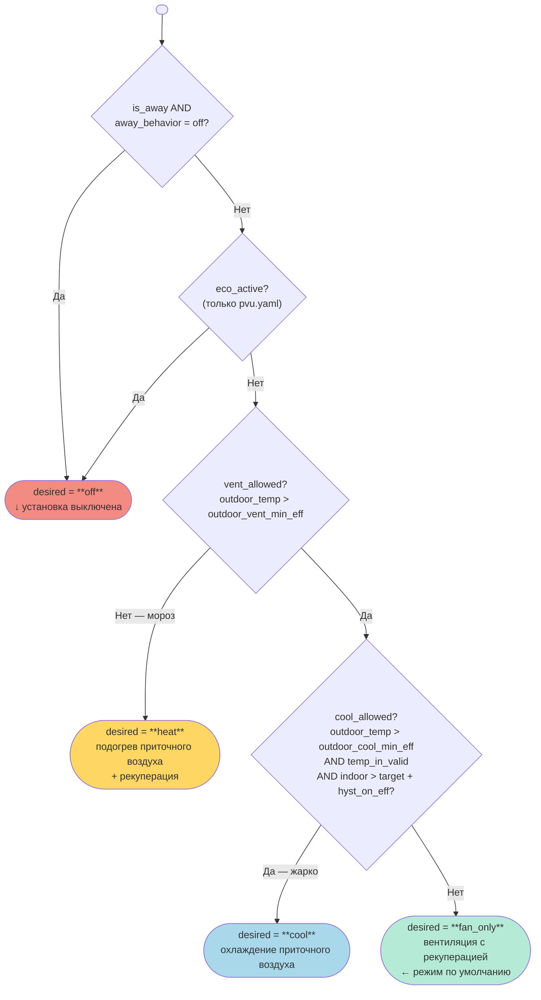
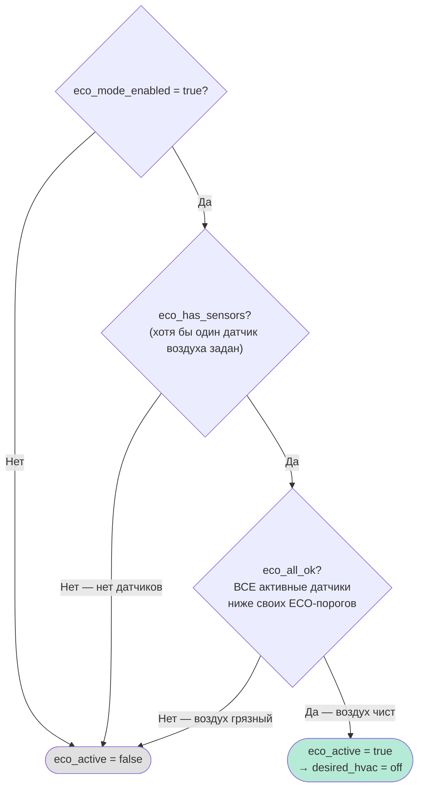
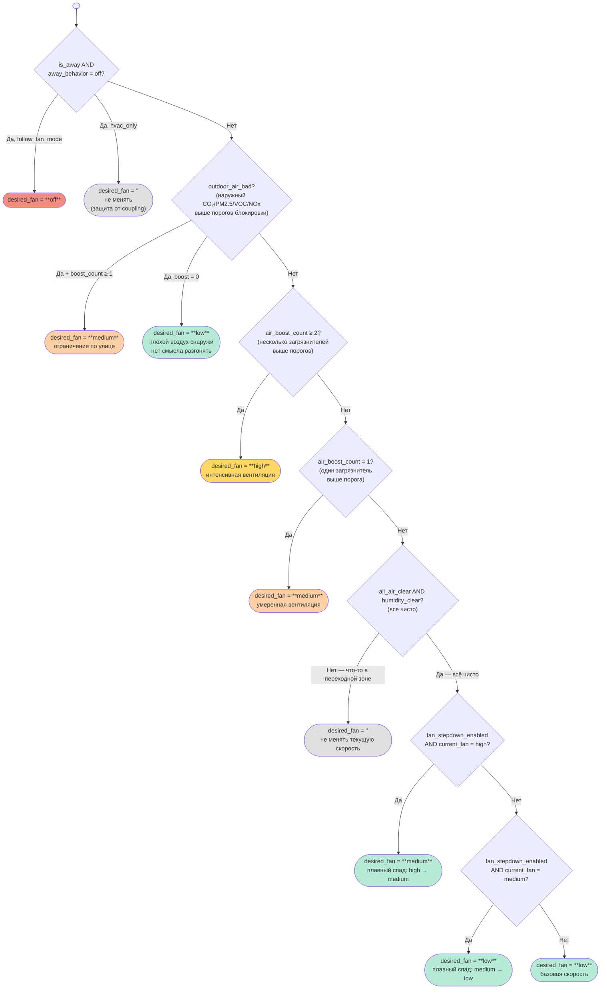
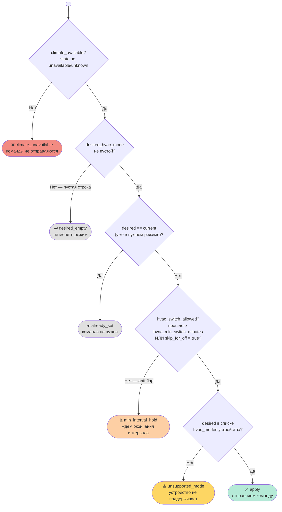
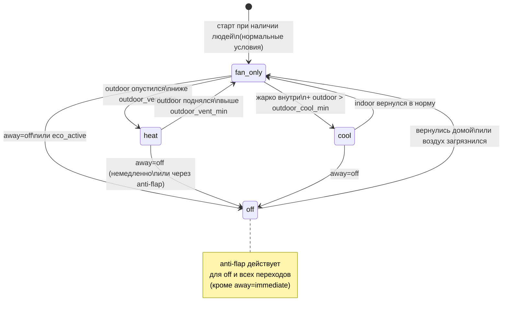

# Алгоритм работы логики pvu.yaml

Документ описывает **все ветки принятия решений** в blueprint `pvu.yaml`.
Для минимального варианта (`pvu_min.yaml`) логика идентична, за исключением отсутствия
ECO-режима, профилей климата/жилья, anti-flap и debug.

---

## 1. Общий цикл

```mermaid
flowchart TD
    TRIGGER(["⏱ Триггер\nтаймер каждые 2 мин\nили изменение датчика"])
    TRIGGER --> VARS["🧮 Вычисление переменных\nвремя / присутствие / t_in / t_out\nIAQ / humidity / ECO флаги"]
    VARS --> HVAC_DECIDE["🔀 desired_hvac_mode\n(см. схему 2)"]
    HVAC_DECIDE --> FAN_DECIDE["🌀 desired_fan_mode\n(см. схему 3)"]
    FAN_DECIDE --> STEP0{"📐 Шаг 0\nclimate_available\nAND desired ≠ off\nAND |current_target − target| > 0.2?"}
    STEP0 -->|Да| SET_TEMP["climate.set_temperature\n= target_temp"]
    STEP0 -->|Нет| STEP1
    SET_TEMP --> STEP1
    STEP1{"⚙️ Шаг 1\nhvac_apply_reason\n= apply?"}
    STEP1 -->|Да| SET_HVAC["climate.set_hvac_mode\n= desired_hvac_mode"]
    STEP1 -->|Нет| STEP2
    SET_HVAC --> POST_HVAC{"debug_mode AND\nverify_delay > 0?"}
    POST_HVAC -->|Да| VERIFY_HVAC["⏳ ждать N сек\nпроверить state\n≠ desired → уведомление"]
    POST_HVAC -->|Нет| STEP2
    VERIFY_HVAC --> STEP2
    STEP2{"⚙️ Шаг 2\nfan_apply_reason\n= apply?"}
    STEP2 -->|Да| SET_FAN["climate.set_fan_mode\n= desired_fan_mode"]
    STEP2 -->|Нет| STEP3
    SET_FAN --> POST_FAN{"debug_mode AND\nverify_delay > 0?"}
    POST_FAN -->|Да| VERIFY_FAN["⏳ ждать N сек\nпроверить fan_mode\n≠ desired → уведомление"]
    POST_FAN -->|Нет| STEP3
    VERIFY_FAN --> STEP3
    STEP3{"🪵 Шаг 3\ndebug_need_notify?"}
    STEP3 -->|Да| NOTIFY["persistent_notification\ndebug_message"]
    STEP3 -->|Нет| END
    NOTIFY --> END(["✅ Конец цикла"])
```

---

## 2. Выбор режима HVAC (`desired_hvac_mode`)

### Примечания к ECO-блоку

**ECO-пороги** (участвуют только если соответствующий датчик задан):

| Датчик | Порог |
|---|---|
| CO₂ | `eco_co2_max` (по умолч. 700 ppm) |
| PM2.5 | `eco_pm25_max` (по умолч. 12 µg/m³) |
| VOC | `eco_voc_max` (по умолч. 200) |
| NOx | `eco_no_max` (по умолч. 8) |
| Влажность | `eco_humidity_max` (по умолч. 60 %) |

---

## 3. Выбор скорости вентилятора (`desired_fan_mode`)

**`air_boost_count`** = сумма активных триггеров: CO₂ > порог + PM2.5 > порог + VOC > порог + NOx > порог + влажность > порога.

---

## 4. Принятие решения о применении (`hvac_apply_reason`)

Аналогичная логика для `fan_apply_reason` (без anti-flap интервала).

---

## 5. Матрица режимов: условие → результат

### HVAC (итоговая таблица)

| Условие (приоритет сверху вниз) | `desired_hvac` | Физика |
|---|---|---|
| `is_away AND away=off` | `off` | Установка выключена |
| `eco_active` (только pvu.yaml) | `off` | Воздух чист, экономия |
| `outdoor < outdoor_vent_min` | `heat` | Подогрев приточного воздуха |
| `outdoor > outdoor_cool_min` AND `indoor > target + hyst` | `cool` | Охлаждение притока |
| Всё остальное | `fan_only` | Вентиляция с рекуперацией |

### Fan (итоговая таблица)

| Условие (приоритет сверху вниз) | `desired_fan` |
|---|---|
| `away=off` + `follow_fan_mode` | `off` |
| `away=off` + `hvac_only` | `''` (не менять) |
| `outdoor_air_bad` + `boost ≥ 1` | `medium` |
| `outdoor_air_bad` + `boost = 0` | `low` |
| `boost_count ≥ 2` | `high` |
| `boost_count = 1` | `medium` |
| Всё чисто + stepdown + текущий `high` | `medium` |
| Всё чисто + stepdown + текущий `medium` | `low` |
| Всё чисто | `low` |
| Переходная зона (не clear, но и не boost) | `''` (не менять) |

---

## 6. Граф состояний ПВУ

---

## 7. Условные обозначения переменных

| Переменная | Описание |
|---|---|
| `vent_allowed` | `outdoor_temp > outdoor_vent_min_eff` (или permissive) |
| `cool_allowed` | `outdoor_temp > outdoor_cool_min_eff` (или permissive) |
| `outdoor_air_bad` | любой наружный датчик IAQ выше порога блокировки |
| `air_boost_count` | количество внутренних IAQ-датчиков, превысивших порог |
| `all_air_clear` | CO₂, PM2.5, VOC, NOx — все ниже нижнего порога |
| `humidity_clear` | влажность ниже нижнего порога (или датчик не задан) |
| `eco_active` | ECO включён + есть датчики + все ниже ECO-порогов |
| `hvac_switch_allowed` | с последнего переключения прошло ≥ `hvac_min_switch_minutes` |
| `skip_hvac_min_interval_for_off` | `away=off` + `away_off_hvac_policy=immediate` |
